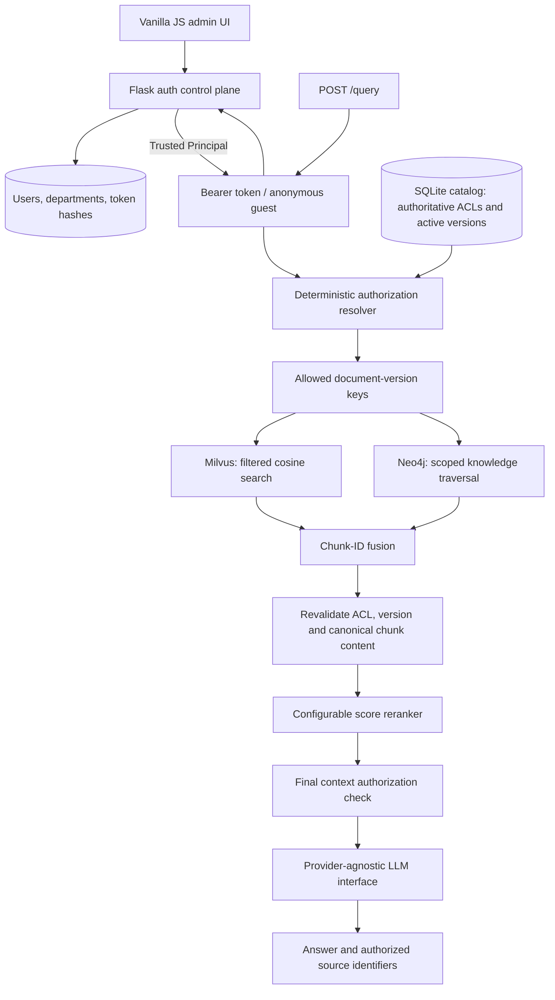

# Authorization-Aware Hybrid Graph RAG

An API-first insurance knowledge service that retrieves the most relevant information the authenticated user is authorized to access. Built with explicit Python interfaces, FastAPI, Milvus, Neo4j, deterministic policies, local CPU embeddings, and an API-based LLM.

Ordinary RAG ranks by relevance. That is insufficient when the closest match belongs to another customer or an employee-only pricing model. Here, access scope constrains retrieval itself. A model instruction is never an access-control decision.

## Architecture



Authorization precedes search, reranking and generation. Database failures return a generic 503; the service never retries with a wider scope. Empty retrieval returns an unavailable-information answer without calling the LLM.

## Access model

| Principal | Public | Own client | Other clients | Internal |
|---|---|---|---|---|
| Guest | Yes | No | No | No |
| Client | Yes | Yes | No | No |
| Internal | Yes | Explicit grant | Explicit grant | Department or explicit grant |

RBAC gates principal roles. Relationship-based access compares a trusted client's membership with the resource's owner; department membership gates employee resources. `allowed_roles`, when provided, is an additional restriction. An internal document with no allowed department is denied unless an explicit internal permission applies.

Supported employee permissions:

- `client:read:client_a`: read resources owned by that client.
- `resource:read:actuarial_pricing`: read a particular private resource, subject to allowed roles.
- `internal:read:all`: read internal resources, not client resources.
- `documents:write`: stage and index documents; this is a trusted administrative capability and does not grant read access.
- `retrieval:debug`: receive numerical retrieval diagnostics when `DEBUG_RETRIEVAL=true`.

Client and guest identities cannot contain employee permissions. Internal employees do not inherit client access through their department. There is no wildcard client grant.

The Flask control plane issues opaque bearer tokens and stores only their SHA-256 hashes. FastAPI sends each supplied token to the private introspection endpoint using a shared service secret. Introspection reads the user's current role, client, department, permissions and active state, so admin changes apply to the next request without re-indexing. Requests without authentication are guests; invalid, expired, revoked or disabled-user tokens return 401. If the auth service is unavailable, FastAPI fails closed with 503.

`AUTH_TOKENS_JSON` remains available as a development fallback when `AUTH_SERVICE_URL` is empty. Docker Compose enables the Flask control plane, so the fallback mapping is ignored there. The optional `principal` request field is only a compatibility assertion and must exactly match the authenticated identity; callers cannot use it to choose access.

### Login and admin control plane

Open `http://localhost:5001/admin`. On a fresh local volume, Compose bootstraps the credentials configured by `AUTH_BOOTSTRAP_USERNAME` and `AUTH_BOOTSTRAP_PASSWORD`. The password is used only when the first administrator is created; changing the environment later does not overwrite that account.

The vanilla JavaScript interface supports:

- creating and editing guest, client and internal users;
- assigning client IDs and departments with role-aware validation;
- granting explicit permissions such as `client:read:client_a`;
- disabling accounts and resetting passwords;
- issuing copy-once, expiring bearer tokens and revoking all user tokens;
- creating departments and preventing deletion while users are assigned.

Admin sessions use HTTP-only, SameSite=Strict cookies and CSRF tokens. Passwords use Werkzeug's scrypt hash. Bearer tokens are returned once and never stored in plaintext. Set `AUTH_COOKIE_SECURE=true` behind HTTPS. Replace the local password login with corporate OIDC/JWT federation when deploying across an organization.

## Retrieval and knowledge graph

`EmbeddingModel` exposes `embed_documents()` and `embed_query()`. The default FastEmbed BGE model runs on CPU and downloads its weights on first use. Milvus stores each chunk's text, document ID, version scope key, authorization metadata, and vector. Search uses COSINE, a configured top-k and similarity threshold, with an explicit `resource_key in [...]` database filter. An empty scope never issues a vector search.

The Neo4j repository stores domain entities such as Product, Benefit, CoverageLimit, Policy, Contract and PricingMethod. Knowledge edges include `COVERS`, `EXCLUDES`, `HAS_LIMIT`, `PRICED_BY`, `REFERENCES`, `DESCRIBES` and `RELATED_TO`. They are distinct from `OWNS`, `CLIENT_OF`, `MEMBER_OF`, `HAS_ROLE` and `CAN_ACCESS` authorization relationships. Client ownership, contract and department management relationships are derived from trusted ingestion metadata. Configured identities are mirrored into the graph at service startup; the graph cannot widen the catalog's authorization decisions.

Entity mentions seed a bounded two-hop knowledge traversal. Every node, resource and returned chunk must belong to the allowed version scope. Entity IDs include their source document version: names shared by two clients cannot accidentally merge private facts. Related entities can be inspected through the authorized graph endpoint.

Candidate fusion deduplicates stable chunk IDs, preserving the strongest vector and graph scores. The replaceable CPU fallback reranker calculates:

```text
score = ALPHA * cosine_score + BETA * graph_score + GAMMA * lexical_overlap
```

Defaults are 0.65 / 0.25 / 0.10. Graph scores decay with path length; lexical overlap is query-term coverage. Scores are heuristic, not calibrated probabilities. The default returns at most five chunks. A cross-encoder can implement the same `Reranker` interface; authorization already runs before that interface receives text.

## Local Docker setup

Prerequisites: Docker Engine/Desktop with Compose v2.24+ and enough memory for Milvus, Neo4j and embeddings (allocate about 8 GB for this demo). Image architecture compatibility depends on the host; consult the [Milvus requirements](https://milvus.io/docs/v2.6.x/prerequisite-docker.md). Python 3.11 and `uv` are needed only for host-side development.

```bash
cp .env.example .env
# Edit .env: set LLM credentials and replace every AUTH_* demo secret/password.
docker compose up -d --build
docker compose logs -f api
curl http://localhost:8000/health
```

The Compose file includes FastAPI, Flask auth, Milvus, etcd, MinIO and Neo4j with persistent volumes and health checks. API startup waits for auth and both databases; the first embedding download may take several minutes. If your installation provides the standalone command, use `docker-compose` in place of `docker compose`.

The fallback tokens and default database/auth credentials are deliberately local-demo values. Change them before loading real data. Ports bind to localhost; MinIO and etcd are not exposed. API and auth run as a non-root user with exactly one worker each. Model weights persist in a separate volume.

Sign in at the admin UI and copy the admin login token, or obtain it from the login API. Then seed the nine synthetic documents (no LLM key is needed for indexing):

```bash
curl -s http://localhost:5001/api/login -H 'Content-Type: application/json' \
  -d '{"username":"admin","password":"your-bootstrap-password"}'

docker compose exec -e INGEST_TOKEN='paste-login-token-here' api \
  python -m scripts.seed_demo_data --api-url http://localhost:8000
```

Open the auth admin at `http://localhost:5001/admin`, API documentation at `http://localhost:8000/docs`, and Neo4j Browser at `http://localhost:7474`.

Milvus also provides a built-in monitoring WebUI at `http://localhost:9091/webui/`.
To start Milvus and its dependencies alone, run `docker compose up -d milvus`.

For host development, start only the databases:

```bash
uv sync --frozen
docker compose up -d milvus neo4j
uv run uvicorn app.main:app --reload --no-access-log
INGEST_TOKEN=demo-ingest uv run python scripts/seed_demo_data.py
```

Use either the containerized API or host API, not both against the same document catalog. Their default catalogs are separate. `docker compose down` retains data; `down -v` permanently deletes the demo volumes.

## API examples

Guest, without credentials:

```bash
curl -s http://localhost:8000/query -H 'Content-Type: application/json' \
  -d '{"query":"What is the pricing methodology?"}'
```

Client A:

```bash
curl -s http://localhost:8000/query \
  -H 'Authorization: Bearer demo-client-a' -H 'Content-Type: application/json' \
  -d '{"query":"What is my outpatient coverage limit?"}'
```

The response contains `query_id`, `answer`, `sources` (chunk and document IDs), and `retrieved_resources`. Raw context text, private titles and candidate diagnostics are not exposed as debug data. Source identifiers in the generated prose are requested by the prompt; the `sources` array is populated deterministically from authorized context.

```bash
curl -s http://localhost:8000/documents -H 'Authorization: Bearer demo-client-a'
curl -s http://localhost:8000/graph/entities/main -H 'Authorization: Bearer demo-client-a'

curl -s http://localhost:8000/documents -H 'Authorization: Bearer demo-ingest' \
  -F document_id=custom-policy -F title='Custom policy' \
  -F 'metadata={"visibility":"client","owner_client_id":"client_a"}' \
  -F file=@data/sample/client_a_policy.md
curl -s http://localhost:8000/documents/index \
  -H 'Authorization: Bearer demo-ingest' -H 'Content-Type: application/json' \
  -d '{"document_id":"custom-policy"}'
```

`POST /documents` accepts multipart PDF, Markdown or TXT (5 MB maximum). `POST /documents/index` embeds the staged version. `GET /documents` lists only active authorized documents. Unknown and inaccessible graph entities both return 404. `/health` checks backing dependencies; it does not make a paid LLM call.

## Ingestion and versioning

Text loading → deterministic character chunking → ACL assignment → embeddings → Milvus → structured extraction → Neo4j → catalog activation.

Document versions hash document ID, title, complete content and ACL metadata. Chunk hashes also include version, offset and chunk content. Content or ACL changes therefore invalidate every old chunk ID even when page numbers and chunk positions are unchanged. Repeated identical ingestion produces identical IDs and replaces existing rows.

Re-indexing first deactivates the catalog entry. Only successful writes to both databases activate the new version. A partial failure remains unavailable and can be retried with `/documents/index`. This trades availability for fail-closed consistency. The final context check reads authoritative catalog metadata and verifies text against canonical chunks rather than trusting backend-provided ACLs or text.

The initial `StructuredKnowledgeExtractor` accepts optional author-curated lines:

```text
@entity plan|Product|Meridian Health
@entity outpatient|Benefit|Outpatient consultations
@edge plan|COVERS|outpatient
```

Invalid entity kinds, relationship kinds or missing endpoints reject ingestion. Documents without annotations still have vector retrieval but do not contribute domain entities. Scanned PDFs need OCR; this implementation rejects documents without extractable text. Extraction never requires an LLM.

## Demonstration scenarios

| Token / principal | Question | Expected authorized evidence |
|---|---|---|
| Anonymous guest | What is the pricing methodology? | Public pricing descriptions only |
| `demo-client-a` | What is my coverage limit? | Client A and relevant public documents |
| `demo-client-a` | Platinum international transplant coverage overseas organ transplants | Client B excluded, despite its stronger match |
| `demo-actuarial` | How is risk pricing calculated? | Actuarial pricing permitted |
| `demo-sales` | How is risk pricing calculated? | Actuarial pricing excluded |
| `demo-sales-permitted` | How is risk pricing calculated? | Explicit resource permission allows actuarial pricing |

Dataset: two public resources, two Client A resources, two Client B resources, actuarial methodology, claims SOP and sales playbook. All accounts, values and canary strings are synthetic. No customer data is needed.

## Verification and benchmarks

```bash
uv run pytest -q
uv run ruff check app scripts tests
uv run ruff format --check app scripts tests
uv run mypy app
docker compose config --quiet

# Live adapter test: isolated Milvus collection and uniquely named graph resources.
RUN_INTEGRATION=1 uv run pytest tests/integration/test_live_stores.py -v

# Real semantic benchmark against the container's catalog and databases; no LLM calls.
docker compose exec api python -m scripts.benchmark_retrieval

# Equivalent when using the host API/catalog:
uv run python scripts/benchmark_retrieval.py

# Fully offline security/regression benchmark using clearly labeled test doubles:
uv run python scripts/benchmark_retrieval.py --offline
```

Benchmarks report document Recall@K, MRR, candidate authorization violation rate, mean retrieval latency and mean reranking latency. Document ranking deduplicates the top-K chunks. The no-authorized-answer case is excluded from recall/MRR and included in isolation checks. Any violation raises an error. An empty unseeded live catalog is rejected. These six synthetic scenarios are regression checks, not a representative evaluation corpus.

Tests exercise the actual resolver, hybrid fusion, reranker and context builder with deterministic backend doubles. They prove guest/client/department isolation, prefilter scope, unauthorized backend-result rejection before reranking, canonical text validation, final revocation checks, fail-closed indexing, version changes, uploads and authenticated API behavior. A separate opt-in integration test uses real Milvus and Neo4j with deterministic embeddings and a recording LLM.

## Observability and security boundary

JSON audit events contain query ID, principal role, candidate counts, authorization rejection count, retrieval/reranking/LLM latency. They omit question text, document contents and bearer tokens. Validation and dependency errors are sanitized. Production access logs are disabled to avoid recording graph entity paths. No conversation memory or response cache is shared across users.

The LLM receives only authorized context and a grounding/citation prompt through the replaceable `LLMClient` protocol. The default adapter uses the [Mistral chat API](https://docs.mistral.ai/api/endpoint/chat). The prompt controls answer quality, not authorization. Authorized content leaves the local machine when generation is enabled, so select an appropriate provider/data policy before using actual private documents.

The trusted boundary includes administrators assigning ACLs, server-side authentication configuration, the SQLite catalog and database operators. Database services are private development dependencies, not independently hardened multi-tenant endpoints. The one-process lock serializes ingestion, retrieval and generation so API-managed ACL changes cannot race an in-flight answer. Do not add workers or external catalog writers without a distributed revision/locking design.

## Limitations and future work

- SQLite auth and catalog stores plus single workers prioritize inspectability over throughput. Move identities to PostgreSQL, add distributed rate limiting/audit history, federate OIDC, and coordinate catalog revisions before horizontal scaling.
- Catalog scope resolution is linear and Milvus receives an explicit ID list. Large installations need indexed policy lookups, scope batching or carefully equivalent database-native ACL predicates.
- Scoped entity copies intentionally limit cross-document graph reasoning. Add provenance-aware entity resolution without merging authorization boundaries.
- Structured extraction and lexical graph seeding are simple. Add curated entity aliases, richer extraction, cross-encoder ranking and a larger independently judged evaluation set.
- Similarity thresholds need domain calibration. Graph lexical matches can be broadly related without answering a question; the generator must acknowledge missing details. Citations are not yet checked against generated prose.
- Embedding model changes require a new compatible collection and re-indexing. No migrations, backups, OCR, antivirus scanning, rate limiting, TLS termination, token rotation or external identity provider are bundled.
- Prompts cannot guarantee hallucination-free answers. The enforced property is authorized retrieved context, not perfect generation or suppression of facts already known to a provider's model.

Milvus service topology follows the [upstream standalone Compose configuration](https://raw.githubusercontent.com/milvus-io/milvus/v2.6.14/deployments/docker/standalone/docker-compose.yml). Neo4j queries use [driver query parameters](https://neo4j.com/docs/python-manual/current/query-simple/) for data; only validated relationship enums become Cypher type names.

## Repository map

`auth_service` owns Flask login, token introspection, identity persistence and the vanilla JS admin UI. `app/auth` owns deterministic resource policy and scope resolution; `app/catalog.py` owns active revisions; `app/vectorstore` and `app/graph` own database adapters; `app/ingestion` owns loading, hashing and extraction; `app/retrieval` owns retrieval/fusion/reranking; `app/llm` owns provider calls; `app/api` owns RAG HTTP endpoints; `app/container.py` wires dependencies. Demo and benchmark tools live under `scripts`, and security, auth, ingestion and integration tests under `tests`.
## Sun Life browser workspace

The local demo uses the [Sun Life logo from its corporate website](https://www.sunlife.com/content/dam/sunlife/global/logos/sun-life/current/sun-life-weblogo-127x31.svg),
stored in `auth_service/static/sun-life-logo.svg` with its original proportions and colors.
This repository is an independent portfolio project, not an official Sun Life product.

The assistant and access-management screens share the enterprise theme in
`auth_service/static/tokens.css`: system sans-serif typography, neutral surfaces,
blue accents, and compact controls. Workspace and admin component styles live in
`workspace.css` and `styles.css`. Source identifiers expand on demand; single and
comma-separated source citations link to the reference panel. The interface adapts
from a two-column laptop workspace to stacked panels on smaller screens.

Open **http://localhost:5001/** for the RAG workspace; access management remains at
**http://localhost:5001/admin**. The vanilla-JavaScript interface includes guest access,
account login, a scoped document library, question history for the current page session,
and answers with clickable source citations. History is not sent as conversation context
and is cleared on account changes. No answers or bearer tokens are persisted in localStorage.

The Flask same-origin gateway takes identity from a validated HttpOnly cookie, never from
a browser-supplied principal. The existing RAG API still authorizes retrieval before generation.
Library rows show metadata, not full document previews. The UI renders model output as text,
not executable HTML. Admin privileges do not automatically grant access to all client records.

With the full Docker stack, run `docker compose up -d --build`.
For the existing setup with the RAG API running in a host terminal, run:

```bash
RAG_API_URL=http://host.docker.internal:8000 docker compose up -d --build auth
```

The host API must use `AUTH_SERVICE_URL=http://localhost:5001` and the same
`AUTH_SERVICE_SECRET` as Flask. For Flask running directly on the host, set
`RAG_API_URL=http://127.0.0.1:8000`. The auth server uses threaded workers so API calls can
introspect identity while a browser request waits for generation. A per-worker limit of two
upstream requests reserves authentication capacity; excess requests receive HTTP 429.
Keep at least four threads per worker. For deployment, use HTTPS,
`AUTH_COOKIE_SECURE=true`, strong session/service secrets, and non-demo passwords.
